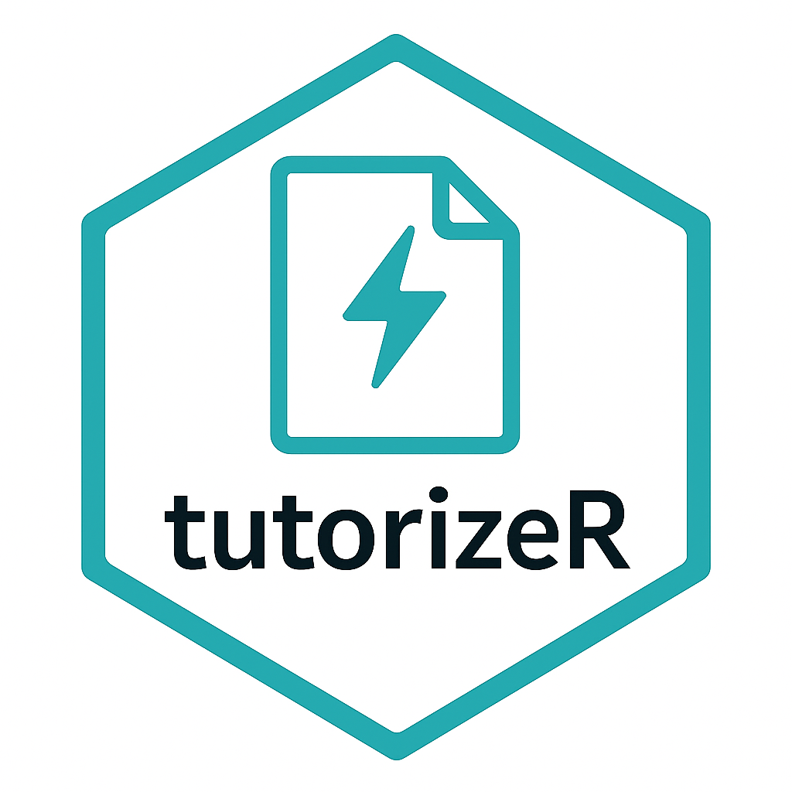

<p align="center">
  
</p>

# tutorizeR

Have a Quarto (`.qmd`) or R Markdown (`.Rmd`) data analysis you want to turn into an interactive tutorial with built-in solutions? This package is what you need.
`tutorizeR` converts existing **R Markdown** (`.Rmd`) or **Quarto** (`.qmd`) files into interactive tutorials powered by [`learnr`](https://rstudio.github.io/learnr/). Each code chunk becomes an exercise block followed by a solution chunk ready to be graded with `gradethis`.

## Features (v0.2.0)

- **Input Support**: Accepts both `.Rmd` and `.qmd` input files.
- **Output Formats**: Generates standard `learnr` tutorials OR `quarto-live` (WebAssembly) tutorials.
- **Pedagogical Control**:
    - Skip specific chunks with `# tutorizeR: skip`.
    - Choose assessment type: `assessment = "code"`, `"mcq"`, or `"both"`.
- **Usability**:
    - Batch convert folders with `convert_folder()`.
    - RStudio Addin for one-click conversion.
- **Robustness**:
    - Preserves `setup` chunks.
    - Strips YAML front matter.
    - Verifies rendering (for learnr tutorials).

## Installation

Install the development version from GitHub with:

```r
# install.packages("remotes")  # if not already installed
remotes::install_github("AurelienNicosiaULaval/tutorizeR")
```

## Usage

```r
library(tutorizeR)

# Convert a Quarto or R Markdown document to a learnr tutorial
convert_to_tutorial("analysis.qmd", assessment = "both")

# Convert to Quarto Live (WebAssembly)
convert_to_tutorial("analysis.qmd", format = "quarto-live")

# Batch convert a folder
convert_folder("labs/")
```

This will create `analysis-tutorial.Rmd` (or `analysis-live.qmd`) containing interactive exercises.
