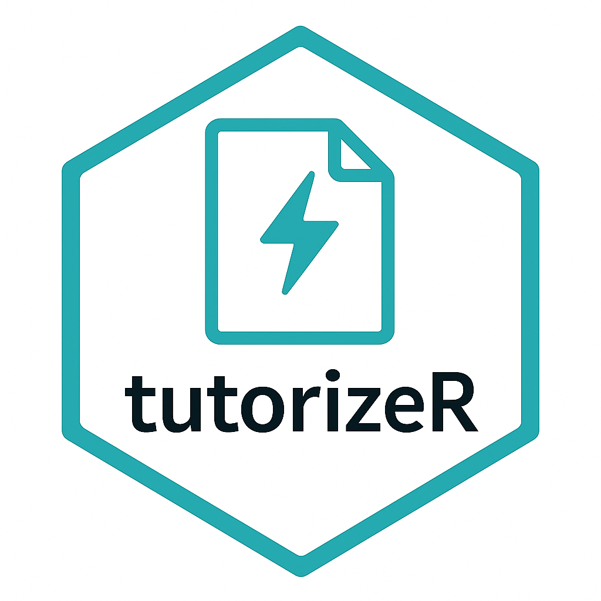

<p align="center">
  
</p>

[](https://github.com/AurelienNicosiaULaval/tutorizeR/actions/workflows/r.yml)
[](https://lifecycle.r-lib.org/articles/stages.html)

# tutorizeR

`tutorizeR` is an R package for converting existing R Markdown (`.Rmd`) and Quarto (`.qmd`) teaching material into interactive tutorial documents for `learnr` and `quarto-live`.

The package is designed for instructors who want to keep one source document while generating student-facing exercises, solution scaffolds, multiple-choice questions, and conversion reports. The core workflow is source-first: revise the lesson source, rerun the conversion, review the generated tutorial, and distribute the result through the course infrastructure already in use.


## Scope

`tutorizeR` supports the following teaching workflows:

- Convert `.Rmd` and `.qmd` lessons to `learnr` tutorials.
- Convert `.qmd` lessons to `quarto-live`-oriented resources.
- Generate exercise and solution blocks from existing R chunks.
- Add conceptual checks through inline MCQ blocks or reusable YAML/JSON question banks.
- Lint source lessons before conversion.
- Write JSON or YAML conversion reports for review and reproducibility.
- Process a folder of lessons with a consistent conversion policy.
- Export LMS-oriented manifests for downstream integration.

The package does not replace instructor review. Generated tutorials should be inspected before they are used with students, especially when assessment, feedback, or grading logic is involved.

The repository currently demonstrates package functionality through tests, vignettes, documentation, and an installable example module. It does not currently contain formal classroom outcome data or measured learning-gain evidence.

## Installation

Choose the installation source that matches your use case.

```r
# CRAN, once the package is available there
install.packages("tutorizeR")
```

```r
# Tagged GitHub release
install.packages("remotes")
remotes::install_github("AurelienNicosiaULaval/tutorizeR@v0.4.4")
```

```r
# Current development branch used for review work
install.packages("remotes")
remotes::install_github("AurelienNicosiaULaval/tutorizeR@review/jose-readiness")
```

## Quick Start

The installed example module contains a Quarto lesson, a small local dataset, a question bank, and expected outputs. The following example copies the lesson to a temporary directory and converts it to a `learnr` tutorial.

```r
library(tutorizeR)

example_dir <- system.file(
  "examples",
  "example_course_module",
  package = "tutorizeR"
)

work_dir <- file.path(tempdir(), "tutorizeR-example")
dir.create(work_dir, recursive = TRUE, showWarnings = FALSE)

file.copy(
  from = file.path(example_dir, "lesson-source.qmd"),
  to = work_dir,
  overwrite = TRUE
)
file.copy(
  from = file.path(example_dir, "student_activity.csv"),
  to = work_dir,
  overwrite = TRUE
)

question_bank <- load_question_bank(file.path(example_dir, "question-bank"))

report <- tutorize(
  input = file.path(work_dir, "lesson-source.qmd"),
  output_dir = work_dir,
  format = "learnr",
  assessment = "both",
  question_bank = question_bank,
  mcq_source = "mixed",
  overwrite = TRUE,
  verbose = FALSE
)

print(report)
```

The returned report records the input file, output file, output format, assessment mode, generated exercises, generated MCQs, lint summary, warnings, and render status when applicable.

## Main Functions

| Task | Functions |
| --- | --- |
| Convert one lesson | `tutorize()`, `convert_to_tutorial()` |
| Convert a folder | `convert_folder()` |
| Work with question banks | `load_question_bank()`, `validate_question_bank()` |
| Check lesson structure | `lint_source()`, `validate_input()`, `validate_output()` |
| Save conversion metadata | `write_tutorize_report()` |
| Export course integration artifacts | `export_lms_manifest()`, `export_tutorial_package()` |
| Use RStudio addins | `launch_tutorizeR_addin()`, `launch_tutorizeR_folder_addin()`, `launch_tutorizeR_preview_addin()` |

## Authoring Syntax

Instructor comments inside R chunks control conversion.

```r
# tutorizeR: hints=Group by program before summarising|Use .groups = "drop"
activity |>
  dplyr::group_by(program) |>
  dplyr::summarise(
    mean_hours = mean(study_hours),
    mean_score = mean(quiz_score),
    .groups = "drop"
  )
```

Supported tags include:

- `skip`
- `exercise-only`
- `solution-only`
- `mcq`
- `narrative-only`
- `locked`
- `hints=Hint 1|Hint 2`

Inline MCQs use YAML inside a `tutorizeR-mcq` fenced block.

```yaml
question: "Which variable identifies the academic program?"
answers:
  - text: "program"
    correct: true
  - text: "quiz_score"
    correct: false
```

Reusable question-bank references use YAML inside a `tutorizeR-mcq-ref` fenced block.

```yaml
ids: [visualization-aesthetic]
strategy: ordered
shuffle_answers: false
```

## Batch Conversion

```r
library(tutorizeR)

question_bank <- load_question_bank("course/question-bank")

folder_report <- convert_folder(
  dir = "course/lessons",
  recursive = TRUE,
  output_dir = "course/tutorials",
  format = "learnr",
  assessment = "both",
  question_bank = question_bank,
  mcq_source = "mixed",
  lint_strict = TRUE,
  overwrite = TRUE
)

print(folder_report)
```

## Documentation

The package includes vignettes that are also used as pkgdown articles:

- [Getting started](vignettes/getting-started.Rmd)
- [Teaching workflow scenario](vignettes/teaching-workflow-scenario.Rmd)
- [Converting a Quarto lesson into an interactive tutorial](vignettes/quarto-lesson-interactive-tutorial.Rmd)
- [Building reproducible data science assignments](vignettes/reproducible-data-science-assignments.Rmd)
- [Reusable question banks](vignettes/question-bank.Rmd)
- [Tags and annotation syntax](vignettes/tags-and-annotations.Rmd)
- [MCQ and assessment modes](vignettes/mcq-and-assessment.Rmd)
- [Lint and debug workflow](vignettes/lint-and-debug.Rmd)
- [Debugging and common errors](vignettes/debugging-and-errors.Rmd)
- [Educational use cases](vignettes/educational-use-cases.Rmd)
- [Documentation website](vignettes/documentation-website.Rmd)
- [JOSE submission readiness](vignettes/jose-submission-readiness.Rmd)

The pkgdown site configuration is stored in `_pkgdown.yml`. The generated site is built into `pkgdown/` so it does not overwrite the repository's source documentation in `docs/`.

```r
pkgdown::build_site()
```

## Quality Control

Recommended local checks for maintainers:

```bash
Rscript -e "testthat::test_local('.')"
Rscript -e "lintr::lint_package()"
Rscript -e "urlchecker::url_check()"
Rscript -e "devtools::document()"
R CMD build .
R CMD check --as-cran tutorizeR_0.4.4.tar.gz
```

Installed example smoke test:

```bash
Rscript -e "source(system.file('examples', 'example_course_module', 'run-example.R', package = 'tutorizeR'))"
```

## Known Limitations

- `learnr` render checks require `learnr` to be installed.
- Generated `learnr` tutorials activate `gradethis` setup only when `gradethis` is installed.
- `quarto-live` output requires the Quarto live extension in the teaching project.
- LMS export is manifest-only in version 0.4 and does not publish directly to a remote LMS API.
- Question banks are local YAML or JSON files in version 0.4.
- Formal learning-outcome evaluation is not included in the repository.

## Review and Publication Materials

Reviewer-facing JOSE and JOSS preparation materials are maintained in the source repository under `docs/` and `paper/`. These files are intentionally kept separate from the CRAN package contents. Claims about classroom deployment, broad adoption, or learning outcomes should be added only when supported by verifiable repository evidence.

## Licensing

The package code is released under the MIT license. The CRAN-style license metadata is stored in `LICENSE`, and the full MIT license text is available in `LICENSE.md`.

Educational example materials in `inst/examples/`, generated expected educational outputs, and graphical documentation assets in `man/figures/` are released under CC-BY 4.0 unless otherwise specified. See `LICENSE-CONTENT.md` and `LICENSES.md` in the source repository.
